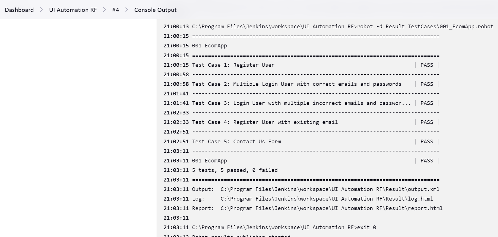
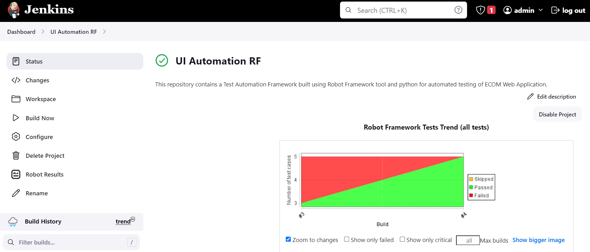

<!--
    #/**
    # * @author Avdhut Shirgaonkar
    # * Email: avdhut.ssh@gmail.com
    # * LinkedIn: https://www.linkedin.com/in/avdhut-shirgaonkar-811243136/
    # */
    #/***************************************************/
-->

---

# 💻# UI-Automation Using RobotFramework

## 📑 Table of Contents

<!-- # - [Video Tutorial](#video-tutorial) -->

- [Introduction](#-introduction)
- [Prerequisites](#️-prerequisites)
- [Getting Started](#️-getting-started)
- [Running Tests](#-running-tests)
- [Project Structure](#-project-structure)
- [Reporting](#-reporting)
- [CICD Using Jenkins](#cicd-using-jenkins)
- [Contacts](#-contacts)

## 📖 Introduction

This repository contains a Test Automation Framework built using Robot Framework tool and python for automated testing of ECOM Web Application.

## 🛠️ Prerequisites

After installing _pycharm_ and _python_, open terminal and install mentioned library to start with robot framework
`pip install robotframework`

## ▶️ Getting Started

1. Clone the repository:

   ```bash
   git clone https://github.com/avdhutssh/UI-Automation_RobotFramework.git
   ```

2. Navigate to the project directory:

   ```bash
   cd UI-Automation_RobotFramework
   ```

## 🚀 Running Tests

```bash
robot -d Result '.\TestCases\001_EcomApp.robot'
```

## 📁 Project Structure

```
├── PageObjects
│   ├── common.robot                # Contains generic keywords (e.g., Launch browser, Get token, Get Json Data, Generate Random Data)
│   ├── loginSignUpPage.robot       # Webelements locators and Keywords for LoginSigUp page
│   ├── HomePage.robot              # Webelements locators and Keywords for Home page
│   ├── CartPage.robot              # Webelements locators and Keywords for Cart page
│   ├── ProductsPage.robot          # Webelements locators and Keywords for Products page
│   ├── Application.robot           # Common Keywords of Application
│   ├── DataManager.robot           # Keywords for fetching data from files
├── Resources
│   ├── global_parameters.robot      # Contains All library to be use across framework, Global parameters and variables
│   ├── requirements.robot           # Includes libraries to be install during CICD execution
├── Results
│   ├── log.html                     # Execution logs
│   ├── report.html                  # Test execution report
│   ├── output.xml                   # Output of test execution
│   ├── screenshots                  # Folder to store screenshots for failed and desire tests
├── TestCases
│   ├── Test Case 1: Register User
│   ├── Test Case 2: Multiple Login User with correct emails and passwords
│   ├── Test Case 3: Login User with multiple incorrect emails and passwords combination
│   ├── Test Case 4: Register User with existing email
│   ├── Test Case 5: Contact Us Form
├── TestData
│   ├── creds.csv                     # CSV file with test data
│   ├── data.json                     # JSON file with test data
├── Utilities
│   ├── CustomLibrary.py              # Utility to get current date, random emails
│   ├── CustomMQTTKeywords.py         # Custom keywords for MQTT functions(Publish on topic, Subscribe to topic, Get Topic Message)
│   ├── Device_OFF_ON.py              # Script to turn Raspberry Pi Relay on/off
│   ├── extract_emails_from_a_user.py # Fetch and verify Gmail contents
│   ├── fetch_emails_Using_APIs.py    # API-based email fetching script
│   ├── getOtp.py                     # For MFA automation
│   ├── JsonManipulation.py           # JSON manipulation functions
│   ├── ReadCsv.py                    # Read CSV file

```

This project is following Page Object Model (**POM**) Approach and using **Hybrid Framework** (keyword driven and Data Driven).

Data driven testing is done by using CSV and Robot Framework BuiltIn Template methods

Utilities using python have been created for MQTT broker verification, gmail validation, making device on off and reading CSV files.

One standalone test script is also created for all test cases flows.

Refer Test script under Test cases folder for execution.

## 📊 Reporting

To generate a report in Robot Framework, you need to run your test suite using the robot command. By default, this command will create three files in the output directory: output. xml, log. html, and report.


<a href="https://jenkins.io">
     
</a>

Install RF plugin to get results at the end of the execution.

Add github credentials in Jenkins Credentials Provider.

Paste repository path and enter branch name as main

Execute Windows batch command and paste the robot command

In Post build actions, select Publish Robot Framework test results




## 📧 Contacts

- [](mailto:avdhut.ssh@gmail.com)
- [](https://www.linkedin.com/in/avdhut-shirgaonkar-811243136/)

Feel free to reach out if you have any questions, or suggestions

Happy Learning!!!
